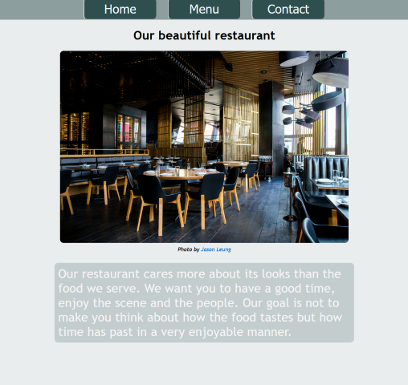

# Restaurant page

This project uses HTML, CSS and Javascript with ES6 modules and Webpack for bundling the modules. The project focuses on DOM manipulation by dynamically rendering the restaurant homepage.

## The Odin Project: Lesson Restaurant Page

This project is build according to the specification of the [Restaurant Page lesson](https://www.theodinproject.com/lessons/node-path-javascript-restaurant-page)

Access <a href="https://gohan61.github.io/restaurant-page">Restaurant page</a>

## Run locally

*In order to run project locally NodeJS + Git needs to installed on your system*

Follow these steps on Mac/Linux/WSL to run the project locally:

1. Open a terminal and go to a directory you want the repository to be in
2. Select Code in the Github project page and copy the SSH URL
3. git clone *SSH URL*
4. 'cd' into the repository you just cloned
5. Run 'npm install'
6. Run 'npm run start'
